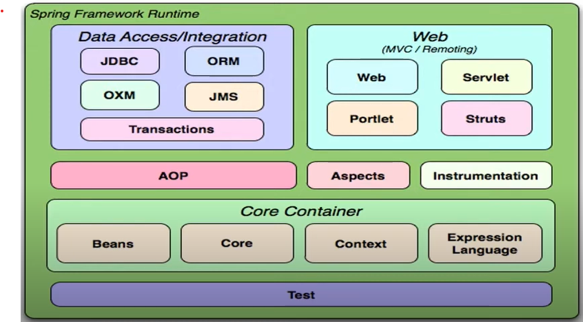
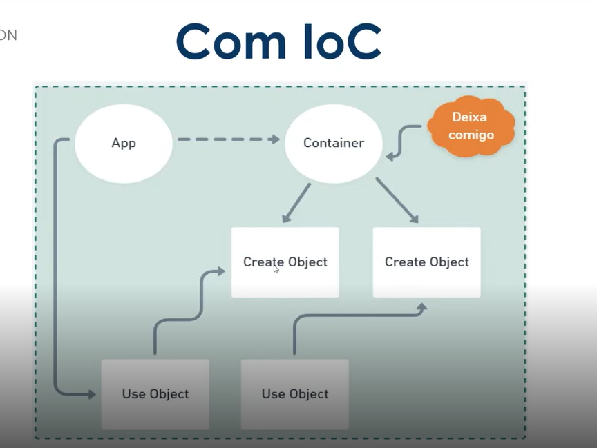

# Spring Framework

- O que é o Spring Framework
- Spring VS JAVA EE
- Conceito de Inversão de controle
- Injeção de dependências
- Beans\ Autowired \ Scopes

## O que é o Spring Framework
    É um framework opensource desenvolvido para a plataforma java baseado nos padrões de projetos
    Sua estrutura é composta por módulos adins de reduzir a complexidade no desenvolvimento aplicações simples ou corporativas

<h3>Mas quais são os módulos do Spring?</h3>

## Spring VS JAVA EE
O spring foi um movimento diante a grande burocracia do ``JAVA EE``

## Conceito de Inversão de controle
Trata-se de um redirecionamento do fluxo de execução de um código retirando parcialmente o controle sobre ele e delegando-o para um container. O principal propósito é minimizar o acoplamento do código

## Injeção de dependências

É um padrão de desenvolvimento com a finalidade de manter baixo o nível de aclopamento entre módulos de um sistema

## Beans\ Autowired \ Scopes
- Beans:
  - É um objeto que é instanciado, montado e gerenciado por um container através do princípio da inversão de controle
- Scopes:
  - Singleton:
    - É usado o mesmo objeto durante o uso do projeto
  - Prototype:
    - É criado um novo objeto para cada solicitação do container
    
- Autowired
  - Uma anotação de onde deverá ocorrer uma injeção automática de dependência
    - byName: É buscado um método set que corresponde ao nome do Bean
    - byType: É consdirado o tipo da classe para inclusão do Bean
    - byConstructor: Usamos o construtor para incluir a dependência

# SpringBoot
O SpringBoot foca na configuração automática, diferente do Framework Spring, que é baseado na injeção de dependências.